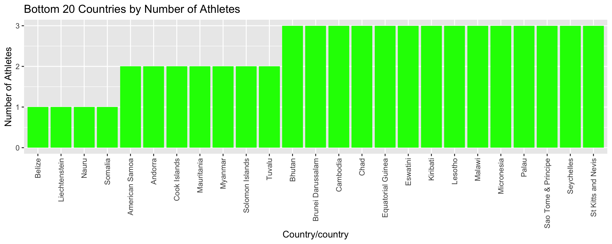

<h1 align="center">2024 Paris Olympic Network Analysis</h1>

#### Jangmin Song  
#### Professor Carrie Diaz Eaton  
#### DCS375 Network Analysis  
#### April 18th 2025  

## 1. Introduction  
200 words

&nbsp;&nbsp;&nbsp;&nbsp;The Summer Olympic Games is the largest international sport event, which is held every four years. There are more than 10,000 athletes from around the world. These athletes train for years to represent their nations on a global stage and compete for excellence in their respective disciplines. In 2024, the Olympics game was held in Paris three years after 2020 Tokyo Olympics that happened in 2021 due to COVID-19 pandemic. There is a dataset in [kaggle.com](https://www.kaggle.com/) called [Paris 2024 Olympic Summer Games](https://www.kaggle.com/datasets/piterfm/paris-2024-olympic-summer-games?select=medallists.csv), which contains all the data of Athletes,  They also offer a rich dataset for exploring global athletic participation, collaboration, and structural patterns across countries and disciplines. This project uses network analysis methods to investigate athlete and country relationships based on shared events, medal achievements, and cross-discipline participation. 

&nbsp;&nbsp;&nbsp;&nbsp;The central questions of this project are the follwings:
- How are athletes socially connected through shared Olympic disciplines and events?
- Which countries act as central hubs in the global sports network?
- Do certain disciplines foster more interconnection between athletes or countries?

&nbsp;&nbsp;&nbsp;&nbsp;I used the language `R` for this project mainly using `bipartite`, `igraph`, and `ggplot2` packages. By visualizing and analyzing these relationships through bipartite graphs, one-mode projections, and centrality metrics, we will find the structural dynamics within the Olympic system that go beyond surface-level competition results.

## 2. Background and Significance
100–150 words

&nbsp;&nbsp;&nbsp;&nbsp;The Olympic Games are not only a platform for international competition but also a representation of global athletic development and cultural investment in sports. Countries have different numbers of how many athletes they send and what disciplines they participate in. I hypothesized that we can potentially find some deeper patterns about the features of athletic ministries in each country and accessibility.

&nbsp;&nbsp;&nbsp;&nbsp;Network analysis can help us to find out these questions. By building the networks, and visualizing the relationships between athletes, countries, and disciplines as networks, we can explore who are connected, how central certain nodes are, and where clusters of similarity or collaboration might happen. Concepts like bipartite graphs, degree centrality, and community detection, which was learned through **DCS 375 Network Analysis** allow us to map these interactions and quantify research in ways traditional medal counts do not. This project applies those techniques to the 2024 Paris Olympics to better understand the collaborative structure of global athletics.

## 3. Data 
150–200 words

&nbsp;&nbsp;&nbsp;&nbsp;Now let’s talk about data. As mentioned in introduction, datasets are from [kaggle.com](https://www.kaggle.com/) and are called `athletes.csv` (all participants) and `medallists.csv` (all medal winners) from [Paris 2024 Olympic Summer Games](https://www.kaggle.com/datasets/piterfm/paris-2024-olympic-summer-games?select=medallists.csv). `athletes.csv` contains variables such as `name`, `gender`, `country`, `disciplines`, `events`, `birth date`, `occupation`, `education`, etc.  `medallists.csv` has information about `medal_date`, `medal_type`, `name`, `country`, etc. In the data cleaning phase, I removed special characters such as brackets, quotation marks from `disciplines` and `events` . Also, I created a new dataset that contains only the variables that I plan to use. 

&nbsp;&nbsp;&nbsp;&nbsp; After the data cleaning, I applied several network analysis skills learned in the DCS375 course. First, I created several bipartite graphs, countries connected to disciplines, athletes connected to disciplines or events, and athletes connected to medal types (Dormann, 2025). These bipartite networks were projected into one-mode graphs. country–country (shared disciplines), athlete–athlete (shared medals), and event–event (shared athletes). Graph objects were constructed with `igraph::graph_from_adjacency_matrix()` or `graph_from_edgelist()`, and layouts were generated using `layout_with_fr()` for force-directed visualization. Edge weights reflect shared attributes (e.g., number of common disciplines or medal types), and vertex sizes are scaled based on node strength. I also computed centrality measures (degree, strength, eigenvector, betweenness) to analyze which countries, athletes, or events played the most central roles within their respective networks.

## 4. Methodology, Visualizations, and Analysis/Observation
250-300 words

After the data cleaning, I applied several network analysis skills learned in the DCS375 course. I have created a bipartite network, unimodal visualizations, projected unipartite network, 1-mode network, and barplot. I have also used statistical analysis for the 1-mode network. Here are methodologies and analysis/observation for each visualization.  

1. **Athlete–Country Bipartite Network**  
Using `frame2webs()` from the `bipartite` package, I constructed a bipartite graph connecting athletes to their respective countries and disciplines. This two-mode network highlights participation patterns across nations. The `plotweb()` function was used for visualization, with label rotation, node scaling, and color customization to improve clarity.

However I have noticed that we cannot able to see some nodes because they are too small. To reduce noise, I grouped countries with 15 or fewer athletes into a collective “Other Countries” node. 

**Analysis/Observation**: I observed that There are many participants in Athletics and Swimmings from many countries. We also see that there are many participants from the countries like US, France, China, Australia, Japan, and Spain. I have also found that there are many countries that have only sent 15 or less athletes because "Other Countries" node is thick. 

2. **Barplots of Athlete Representation by Country**  
I used `ggplot2` to create horizontal bar plots showing the number of athletes from each country. One plot showed the top 20 countries by participation, while another showed the bottom 20. These visualizations provided context for understanding the structure of the collaboration networks and guided decisions about which countries to highlight or combine in later graphs.

**Analysis/Observation**: I found out that the many developed countries sent many athletes, while other countries that have few populations or small country size have sent less athletes. USA has sent the most athltes to Paris Olympic and had 619 athletes, while Belize, Liechtenstein, Nauru, and Somalia had 1 athlte representing from each country. It is very sad to see how there are massive difference between those countries.

3. **Bipartite Participation Network of Bottom 20 Countries**  
I was curious about what disciplines athletes attend if their country has very few participants, and whether these smaller athletes attending countries share similarities in sport participation. To explore this, using the filtered data from the previous section, I created a **bipartite network** connecting countries (nodes on one side) to Olympic disciplines (nodes on the other). I filtered the dataset to include only the bottom 20 countries by athlete count. Using the `frame2webs()` and `plotPAC()` functions from the `bipartite` package, I visualized the connections between these countries and their attended disciplines.

**Analysis/Observation**: Most of the countries share one discipline. Some countries share multiple disciplines. Bhutan and Chad share Archery and Athletics, and Sao Tome and Principe and Chad share Athletics and Judo. Liechtenstein did not share any discipline with any of the other few athletes attending countries, and in fact, PUENTENER Romano was the only athlete attended this Olympic from Liechtenstein and competed in Cycling Mountain Bike. 

4. **Country–Country Collaboration Network (Projected 1-mode)**  
I created a projection of the country–discipline bipartite matrix into a country–country graph using matrix multiplication. Two countries are connected if their athletes competed in at least one shared discipline. I filtered for countries with more than 10 disciplines to focus on active NOCs and scaled edge widths based on the number of shared disciplines. Central countries were highlighted in red to represent top participation breadth.

**Analysis/Observation**:
Countries colored in gold (those outside the top 10) tend to cluster little scattered but still maintain dense connectivity. This suggests that even mid-sized Olympic nations share a significant number of disciplines with top countries, likely because of universally accessible sports like Athletics, Judo, and Swimming. This network helps illustrate global sport alignment: countries tend to train and send athletes to similar sets of disciplines, which could reflect global norms in Olympic preparation, shared funding priorities, or mutual access to more accessible disciplines. The visualization also highlights which countries serve as **participation hubs**, structurally linking diverse parts of the Olympic ecosystem.

5. **5 Number Summary**

6. **Athlete–Medal Type Network and Clustering (Japan)**  
By creating a bipartite graph between athlete names and medal types, I projected this into a 1-mode network connecting athletes who won the same type of medal. It ended up clustering by themselves because it's connected by what types of medals athteles got. I first started with the entire medalists, and I have colored them to Gold, Silver and Bronze by using the `cluster_louvain` based on the what types medals they have received.

Since I am from Japan, just for the curiosity, I have filtered Japan, and did the similar process. 

**Analysis/Observation:**  The global network of medalists reveals clear and strong clustering patterns when athletes are grouped by the type of medal they received. When I filtered only for **Japanese medalists**, I observed similar behavior. Although the scale is smaller, the clustering still reflects the distinction between medal types. Most athletes grouped tightly with others who received the same medal, especially within gold and silver clusters. This suggests that Japanese medalists tend to win medals in groups — possibly from team events, or within strong national programs in particular disciplines such as Judo, Wrestling, and Fencing. One interesting detail we can find in Japanese medalists is OKA Shinnosuke stands out a lot in this clutering. It refers that this athlete has recieved multiple medals, and in fact, he competed in Gymmastics, and recievd 3 Gold medals and 1 Bronze medal. We can observe that he has connections with all the athletes who have recieved Gold or Bronze, but does not have connections with any silver medalists. 

Each visualization was paired with interpretation and statistical measures to help reveal broader structural dynamics at the athlete, event, and country levels in the Olympic data.

## 5. Interpretation & Takeaways
100-150 words

## 6. Conclusion
100 words

## 7. References
- UGNAR
- Intro2bipartite
- Kaggle.com Paris 2024 Olympic Summer Games
- One paper about this olympic
